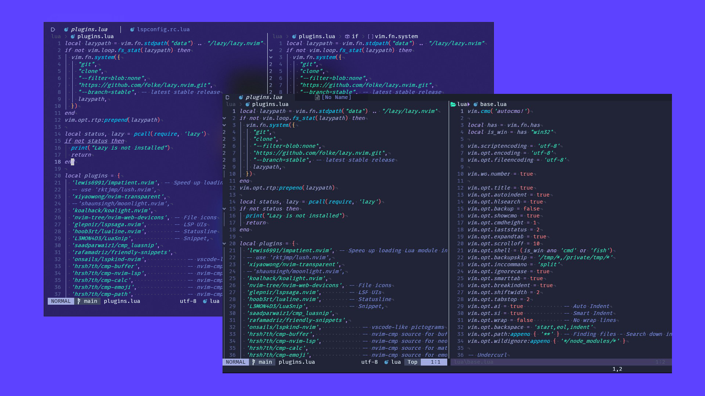

# 🌒 + 🐨 = koalhack/koalight.nvim

> Created with [colorgen](https://github.com/ChristianChiarulli/colorgen-nvim)



Koalight is a Neovim colorscheme based off the [Moonlight Theme](https://github.com/atomiks/moonlight-vscode-theme) for VSCode.
This theme was largely inspired by [Shaunsingh's moonlight.nvim](https://github.com/shaunsingh/moonlight.nvim) version,
which was a high-quality theme, but the theme in question has not been maintained over time.
So I took it upon myself to create a new version that would be maintained.

<details>
    <summary>🎇 Supported plugins</summary>

- [TreeSitter](https://github.com/nvim-treesitter/nvim-treesitter)
- [LSP Diagnostics ](https://neovim.io/doc/user/lsp.html)
- [LSP Saga](https://github.com/nvimdev/lspsaga.nvim)
- [Git](https://github.com/dinhhuy258/git.nvim)
- [Git Signs](https://github.com/lewis6991/gitsigns.nvim)
- [Telescope](https://github.com/nvim-telescope/telescope.nvim)
- [WichKey](https://github.com/folke/which-key.nvim)
- [Indent Blankline](https://github.com/lukas-reineke/indent-blankline.nvim)
- [Dashboard](https://github.com/nvimdev/dashboard-nvim)
- [BufferLine](https://github.com/akinsho/bufferline.nvim)
- [Lualine](https://github.com/nvim-lualine/lualine.nvim)
</details>

<details>
    <summary>📦 Install</summary>

To install Koalight you need a plugin manager.

- [Lazy.nvim](https://github.com/folke/lazy.nvim)
- [Packer](https://github.com/wbthomason/packer.nvim)

Lazy

```lua
return {
    'koalhack/koalight.nvim'
}
```

Packer

```lua
use 'koalhack/koalight.nvim'
```

</details>

<details>
    <summary>⚙️ Configure</summary>

Enable the colorscheme:

Lua

```lua
local status, koalight = pcall(require, "koalight")
if (not status) then return end

vim.cmd.colorscheme 'koalight'
```

</details>

<details>
    <summary> 🌑 Lualine</summary>

Enable the `koalight` theme for `Lualine`:

Lua

```lua
local status, lualine = pcall(require, "lualine")
if (not status) then return end

lualine.setup {
  options = {
    theme = 'koalight'
  }
}

```

</details>

## 🌈 Credit / Inspiration

- [Colorgen](https://github.com/ChristianChiarulli/colorgen-nvim)
- [Moonlight Theme](https://github.com/atomiks/moonlight-vscode-theme)
- [Shaunsingh's moonlight.nvim](https://github.com/shaunsingh/moonlight.nvim)
